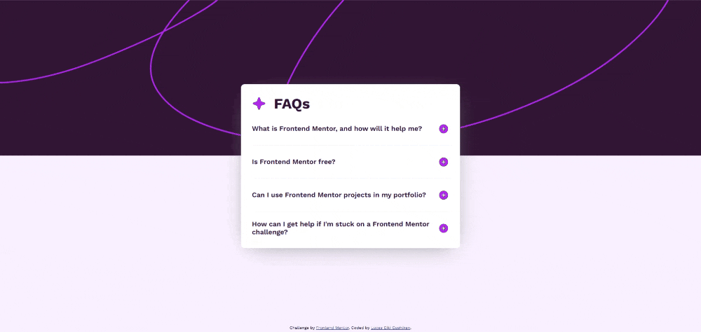

# Frontend Mentor - Solução do FAQ accordion

Este projeto é a solução do desafio [FAQ accordion do Frontend Mentor](https://www.frontendmentor.io/challenges/faq-accordion-wyfFdeBwBz). Um projeto que simula situações do mundo real onde tive que criar uma seção de Perguntas Frequentes (FAQ).

## Sumário

- [Visão Geral](#visão-geral)
  - [O Desafio](#o-desafio)
  - [Capturas de tela](#capturas-de-tela)
  - [Links](#links)
- [Processo](#processo)
  - [Feito com:](#feito-com)
  - [Aprendizados](#aprendizados)
- [Autor](#autor)


## Visão Geral

### O Desafio

Usuários devem ser capazes de:

- Mostrar ou esconder as respostas das perguntas quando for clicado
- Ver o layout da página da forma mais otimizada de acordo com o tamanho da tela
- Ver os elementos interativos da página ao colocar o cursor em cima

### Capturas de tela



### Links

- Solução no Frontend Mentor: [Add solution URL here](https://your-solution-url.com)
- Site: [Add live site URL here](https://your-live-site-url.com)

## Processo

### Feito com:

- HTML
- CSS | Flexbox | Grid
- Javascript

### Aprendizados

Reforcei meus conhecimentos da tríade do Desenvolvimento Web (HTML, CSS, Javascript) e pude colocar em prática minhas habilidades e ensinamentos que já havia estudado.

Um dos trechos de código que achei mais útil foi o uso de CSS Grid para animar um `height: auto`:

```css
.question-container {
    display: grid;
    grid-template-rows: 50px 0fr;
    transition: .3s ease-in-out;
}

.question-container.active {
    grid-template-rows: 50px 1fr;
}

```

## Autor

- Linkedin: [Lucas Eiki Gushiken](https://www.linkedin.com/in/lucaseikigushiken)
- Frontend Mentor - [@EikiDev](https://www.frontendmentor.io/profile/EikiDev)

